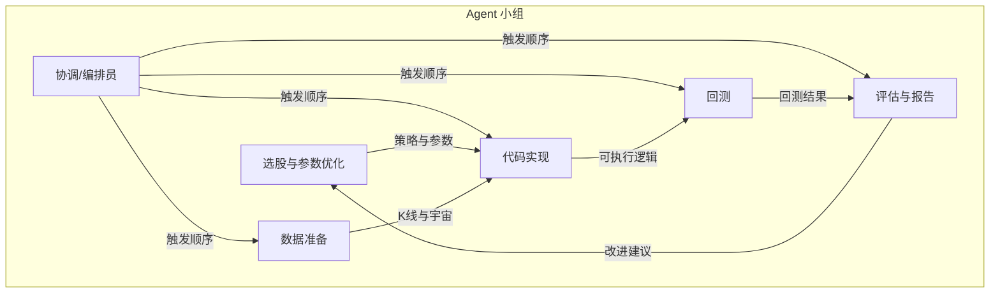

# Agent 小组说明

本项目的选股与回测流水线由 6 个角色协作完成。在 Cursor 中可通过 @ 引用本文件或对应规则，让模型扮演指定成员。

---

## 1. 选股与参数优化

- **职责**：设计/优化选股逻辑与参数；定义评分与过滤条件；决定策略思路（如趋势+回踩、突破等）。
- **输入**：评估与报告员给出的改进建议；当前策略表现与痛点。
- **输出**：策略思路文档；`bt_config.yaml` 中 `strategy_params` 的调整建议或直接修改；新策略名称与参数含义说明。
- **主要涉及**：`bt_config.yaml`（`strategy`、`strategy_params`）、策略思路文档。
- **约定**：不直接改 `strategies/*.py` 的实现细节，只定义「要什么」；具体实现交给「代码实现」成员。

---

## 2. 代码实现

- **职责**：把选股与参数需求落地为可执行代码；实现/修改策略接口、选股脚本、回测调用方式。
- **输入**：选股与参数优化给出的策略与参数需求；数据准备提供的 K 线/宇宙接口。
- **输出**：可运行的选股与回测逻辑；符合 `BaseStrategy` 的策略实现。
- **主要涉及**：`run_daily.py`、`strategies/`（含 `base.py`、`trend_ma.py` 等）、`backtest.py`。
- **约定**：策略参数从 `bt_config.yaml` 或 run_daily 的配置读取，不写死；数据拉取与缓存交给「数据准备」。

---

## 3. 数据准备

- **职责**：K 线拉取、补全、缓存；选股宇宙列表（hs300/zz500/sz50/zz1000/zz2000）；数据目录与状态管理。
- **输入**：回测/选股所需的日期范围、股票列表、复权方式等。
- **输出**：可被 `load_kline`/`get_stock_list` 等使用的数据与接口；补全脚本的维护。
- **主要涉及**：`data/kline_loader.py`、`data/universe.py`、`supplement_kline.py`、`data/kline/`、`data/state.json`。
- **约定**：不修改策略逻辑或回测引擎；只保证数据可用、格式一致。

---

## 4. 回测

- **职责**：读取配置、运行回测、产出收益曲线、夏普、回撤、换手等指标；保证回测引擎与配置一致。
- **输入**：`bt_config.yaml`；策略实现；数据准备提供的 K 线与宇宙。
- **输出**：回测结果（指标、曲线、日志）；供评估与报告使用的原始数据。
- **主要涉及**：`backtest.py`、`bt_config.yaml`（回测起止日期、基准、复权等）。
- **约定**：不修改策略评分逻辑或数据拉取逻辑；只负责「按配置跑回测并输出结果」。

---

## 5. 评估与报告

- **职责**：解读回测结果（收益曲线、夏普、回撤、换手）；判断是否过拟合或参数过于敏感；撰写简洁报告；向「选股与参数优化」输出可执行的改进建议。
- **输入**：回测产出的指标与曲线；当前 `bt_config.yaml` 中的策略与参数。
- **输出**：报告文档（结论 + 主要指标摘要）；**可执行改进建议**（如：放宽/收紧某参数、增加过滤条件），供选股与参数优化下一轮迭代。
- **主要涉及**：`output/*_report.md`、回测输出文件、`bt_config.yaml`（只读参考）。
- **约定**：报告固定包含「结论」与「至少三条具体改进建议」；建议需对应到具体参数或过滤条件，便于优化成员执行。

---

## 6. 协调/编排员

- **职责**：决定执行顺序（先补数据 → 选股 → 回测 → 评估）；何时触发哪一步；简单错误重试或通知；一键/定时跑完整流水线。
- **输入**：`bt_config.yaml`（宇宙、基准、回测区间等）；可选命令行参数（如只跑某几步、覆盖日期）。
- **输出**：按顺序执行的数据补全、选股、回测；汇总日志与产出路径；失败时重试或明确报错。
- **主要涉及**：`run_pipeline.py`（自动化工作流脚本）、`bt_config.yaml`（只读用于传参）。
- **约定**：不实现具体策略或数据逻辑，只调用各步骤脚本并传递配置；单步失败可配置重试次数与间隔。

---

## 流水线顺序

由 **协调/编排员** 驱动的自动化顺序：

1. **数据准备** → `supplement_kline.py`，保证 K 线与宇宙可用  
2. **选股** → `run_daily.py`，产出当日池与报表  
3. **回测** → `backtest.py`，产出收益/回撤等与 `output/backtest_report.md`  
4. **评估与报告** → 人工或 Agent 根据回测结果撰写 `output/*_report.md` 与改进建议 → 回到 **选股与参数优化**

一键执行：`python run_pipeline.py`（可选 `--skip-data` / `--skip-daily` / `--skip-backtest` 跳过某几步）。
